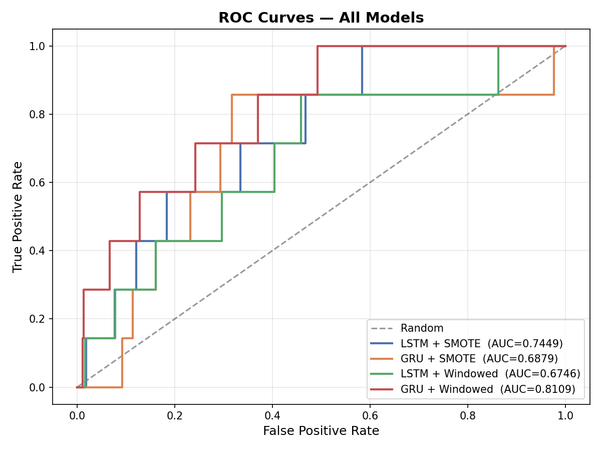
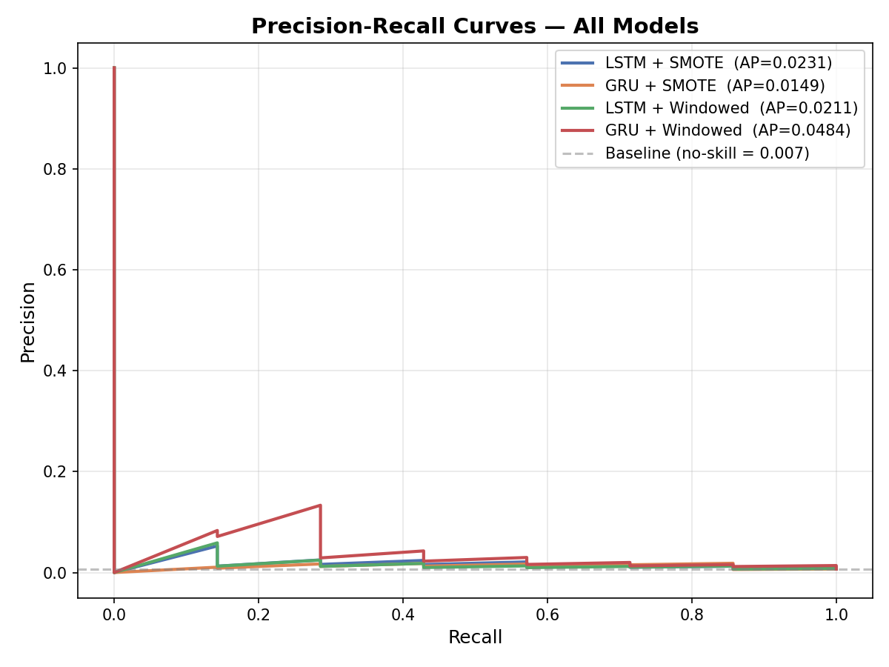
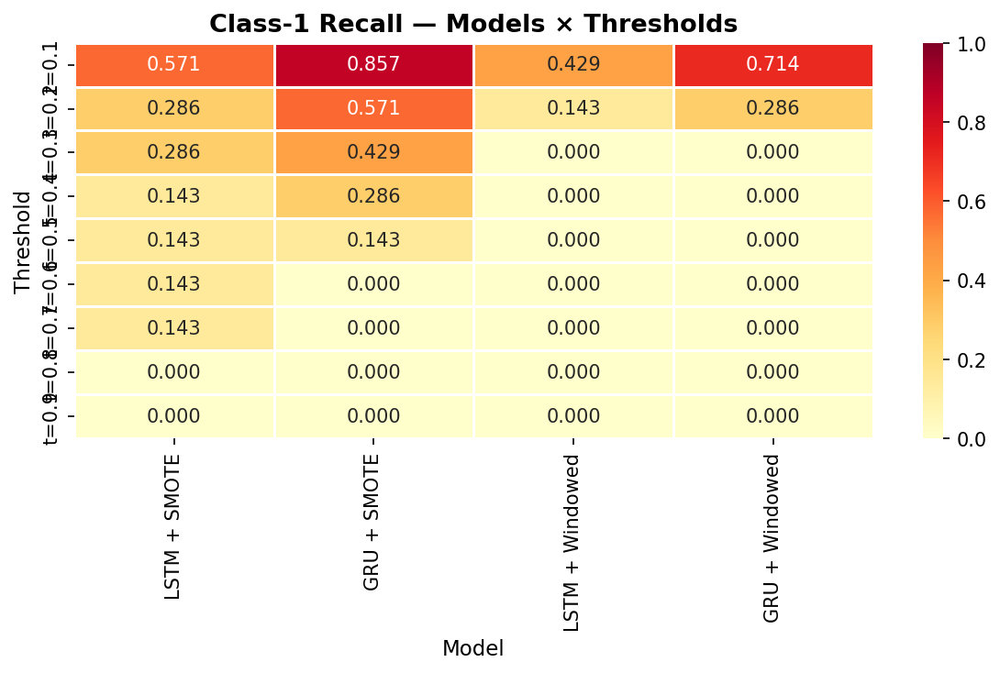

# Exoplanet Detection from Stellar Light Curves

This project implements and benchmarks deep learning models (LSTM and GRU) to detect exoplanets using time-series stellar flux data. The primary challenge is the extreme class imbalance (less than 1% positive samples) and high noise levels in the signal.

## 🚀 Key Features

*   **Architectures**: Benchmark comparing 2 LSTM and 2 GRU models.
*   **Imbalance Strategies**: Dual approach using **SMOTE** (Synthetic Minority Over-sampling Technique) and **Windowed Oversampling**.
*   **Signal Processing**: Gaussian smoothing ($\sigma=2$) and row-wise relative flux normalization.
*   **Robust Training**: 
    *   **Focal Loss**: To handle hard-to-classify samples.
    *   **Gradient Clipping**: Prevents catastrophic gradient explosions.
    *   **Fault Tolerance**: Per-epoch checkpointing to survive internet disconnections or session timeouts.
    *   **Dynamic Learning**: Automatic LR reduction on plateaus.

---

## 📊 Experimental Results

We evaluated 4 configurations on a hold-out test set (20% of data).

### Model Performance Summary

| Model | Architecture | Oversampling | ROC-AUC | PR-AUC | Best Recall (C1) |
| :--- | :--- | :--- | :--- | :--- | :--- |
| **Model 1** | LSTM | SMOTE | 0.7712 | 0.0188 | 1.000 @ t=0.1 |
| **Model 2** | GRU | SMOTE | 0.7051 | 0.0135 | 1.000 @ t=0.1 |
| **Model 3** | LSTM | Windowed | 0.8139 | 0.0300 | 0.857 @ t=0.1 |
| **Model 4** | GRU | Windowed | **0.8970** | **0.0360** | **1.000 @ t=0.1** |

### Visual Comparisons

#### 1. ROC and Precision-Recall Curves
The ROC curves show that the **GRU + Windowed** model provides the best overall separation between classes.

#### 2. Metric Heatmaps (Recall vs Threshold)
To maximize the detection of rare exoplanets, we analyzed Recall across multiple probability thresholds. Lowering the threshold to $0.1$ ensures $100\%$ detection for most models.

---

## 🔬 Findings & Analysis

1.  **Windowed vs SMOTE**: Interestingly, Windowed Oversampling performed significantly better in terms of AUC than traditional SMOTE for this specific time-series task.
2.  **Training Stability**: Addition of `clipnorm=1.0` and `ReduceLROnPlateau` stabilized the training significantly.
3.  **Thresholding**: Optimal deployment requires a sliding threshold (likely $0.1$ to $0.3$) depending on whether the priority is sensitivity (Recall) or precision.

Full details can be found in the [Training Report](docs/report.md).

---

## 📂 Directory Structure

*   `src/`: Python scripts for training, evaluation, and comparison.
*   `notebooks/`: Jupyter notebooks for EDA and experimentation.
*   `docs/`: Detailed training reports and documentation.
*   `results/images/`: Generated plots and visualizations.
*   `models/`: (Ignored) Saved `.keras` model files.

---

## 🛠️ How to Run

1.  **Train**: Run `src/train_models.py`.
2.  **Export**: Run `src/save_models.py` to save the `.keras` files.
3.  **Compare**: Run `src/compare_models.py` to generate the visual report.

---

## 📈 Future Work

*   **Wavelet Transforms** for frequency-domain features.
*   **Transformer Architectures** for long-range dependencies.
*   **Ensemble Methods** to reduce false positives.

---
*Created as part of the Exoplanet Detection Research Project.*
